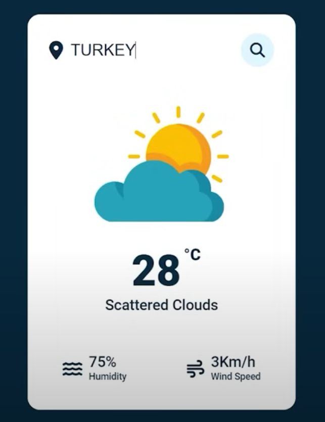

Weather application created using JavaScript, CSS, and HTML.

Link to the project: https://github.com/maryhosseiny/SimpleProjects/tree/main/SimpleWeatherApp

Photos of what the application looks like:

